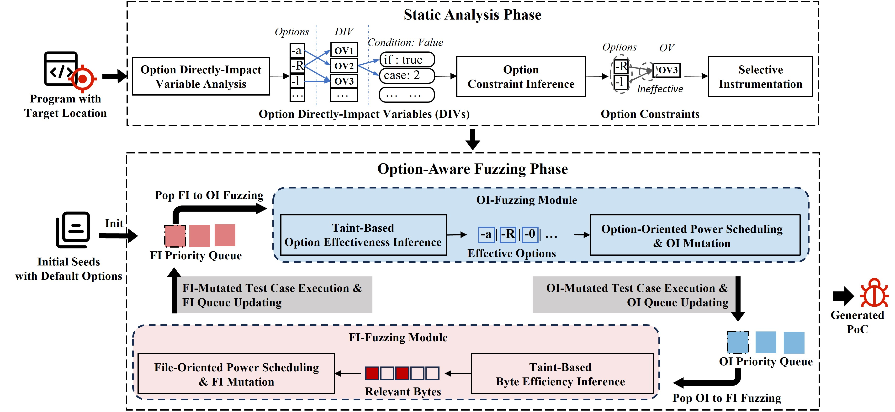

# It Takes Two: Option-Aware Directed Greybox Fuzzing for Vulnerability PoC Generation

---

[](LICENSE)
[](https://kernel.org/)

## Overview


Static analysis tools can identify potential vulnerabilities, but they often fall short in providing concrete proofs-of-concept (PoCs) to validate their findings. Directed greybox fuzzing (DGF) has emerged as a promising solution by systematically guiding execution toward suspicious code locations and generating reproducible PoCs that can trigger the target vulnerabilities. However, DGF tools often overlook the influence of configurable options on reaching target locations. Besides, option-aware greybox fuzzing (GF) tools suffer from ineffective option extraction to target locations, and inefficient coordination between options and file fuzzing.

To address these limitations, we present CoupleFuzz, a novel option-aware DGF tool that redefines PoC inputs as the combination of option input (OI) and file input (FI). CoupleFuzz adopts a two-phase workflow. The static analysis phase extracts option knowledge for guiding the fuzzing. The option-aware fuzzing phase employs taint analysis to dynamically prioritize effective option combinations and file bytes to target locations, and introduces a novel cross-guided fuzzing strategy that coordinates OI and FI fuzzing modules and enables each module to adapt to and benefit from its counterpart's advances,  iteratively driving execution toward the target locations efficiently. 
Our evaluation has demonstrated that CoupleFuzz significantly outperforms the state-of-the-art DGF tools in generating PoCs for 22 real-world vulnerabilities, generating 15 (a 3.1X improvement) more PoCs than the best traditional DGF baseline and achieves an average speedup of 5.6X to reach target locations, with 6 0-day vulnerabilities confirmed by developers and 1 CVE identifier assigned.


---

## ✨ Novel Features

- 🔍 **Value Space Analysis of DIVs**: CoupleFuzz analyzes how each option influences the values of its associated directly-impact variables(DIVs)
- 🌱 **Holistic DIV Constraint Extraction**: Two option sets conflict when their combined DIV sets are identical
- 🌳 **Taint-Based Impactful Option Extraction**: CoupleFuzz selects options based on the associated DIVs that are used along the execution path
- 📊 **Effective Option Extraction**: Extract the options that do not overwrite the selected option set
- 🎯 **Option-Oriented Power Scheduling**: CoupleFuzz introduces an energy allocation strategy that dedicates a portion of fuzzing effort to the Option-Input part. 
- 🚦 **Taint-Based Byte Efficiency Inference**: Perform fine-grained mutation on the bytes associated with the newly discovered path.

---

## 🗂️ Project Structure Overview
| Folder | Description |
| ------ | ----------- |
| [fuzzer](./fuzzer/) | 🧩 Option-Aware Fuzzing |
| [fig](./fig/) | 🖼️ Key figures used in the paper. |
| [evaluation](./evaluation/) | 📊 Detailed experimental data for all RQs in the paper. |

---

## 📜 Project Structure
✅: **Indicates files provided by us.**
```
CoupleFuzz/
├── fuzzer/              # Option-Aware Fuzzing    
│   ├── afl-fuzz.c       # Option-Oriented Power Scheduling, Execute OI Mutation & FI Mutation, OI Queue & FI Queue scheduling   
│   ├── option_mutation.c  # Effective Option Extraction
│   ├── bb_mutation.c  # Efficiency Bytes Extraction
│   ├── dispatcher.py     # Execute Taint-Based Impactful Option Extraction & Taint-Based Byte Efficiency Inference & Option Constraint Inference
│   ├── instrument/src/cbi.c # Calculate Distance and Selective Instrument
|   ├── llvm_mode/
│   ├── afl-clang-fast.c # Compile *.bc to executable
│   ├── argv-fuzz-inl.c  # Dynamic Link Libraries are used to replace argv and argc in the program under test.
│   ├── op-modeling/ # Taint-Based Impactful Option Extraction & Taint-Based Byte Efficiency Inference
│   ├──── pass/
│   ├────── OptionHandlingPass.cpp # Taint DIVs and FI Bytes
│   ├──── runtime/
│   ├────── variable_handers.rs # Collect Tainted DIVs
│   ├────── bb_taint_set.rs # Collect Tainted Bytes
│   └────── compiler/test_clang.c # Wrap OptionHandlingPass and compile the program under test to include taint inference.
├── evaluation\
│   ├── RQ1 # RQ1: Efficiency Evaluation on Option-Unavailable Dataset
│   ├── RQ2 # RQ2: Efficiency Evaluation on Option-Available Dataset
│   └── RQ3 # RQ3: Ablation study
```


---

## 🛠️ Installation & Setup

### 1. Compiler Envirnment Setup (Ubuntu:20.04)
```bash
sudo apt-get install clang-12 lld-12
apt-get install -y xz-utils cmake ninja-build gcc g++ python3 doxygen python3-distutils
apt install -y libc6-dev-i386 gcc-multilib g++-multilib
apt install clang-10 libc++-10-dev libc++abi-10-dev
apt install libpcre3 libpcre3-dev -y
git clone https://github.com/SRI-CSL/gllvm.git
cd gllvm
git checkout v1.3.0
go install ./cmd/...
# build SVF
git https://github.com/SVF-tools/SVF
cd SVF
git checkout SVF-2.3
source ./build.sh
```


### 2. Build CoupleFuzz
#### Build Fuzzer
```bash
export CC=clang-12
export CXX=clang++-12
export LLVM_CONFIG=llvm-config-12
export AFL_REAL_LD=ld.lld-12
cd CoupleFuzz && make 
cd instrument && bash ./build.sh
```
#### Build Option Dynamic Inference Moudle
```bash
cd op-modeling
./build.sh
```
### 3. Install Joern 1.1.1066
```
curl -L "https://github.com/joernio/joern/releases/latest/download/joern-install.sh" -o joern-install.sh
chmod +x joern-install.sh
./joern-install.sh --interactive
```

## 🚀  Usage Example
Download the latest source code of libtiff:
```bash
git clone https://gitlab.com/libtiff/libtiff.git
```
### Step 1: Extract Option DIV and Constraint
```
cd static_parser
bash parsing.sh CVE-2023-0796
```

### Step 2: Calculate Distance and Selective Instrument

```bash
cd libtiff
export PATH=/usr/lib/llvm-12/bin:$PATH
export PATH=/usr/lib/llvm-12/lib:$PATH
export PATH=/root/go/bin:$PATH

export CC="gclang"
export CXX="gclang++"
export CFLAGS="-g -fno-omit-frame-pointer -Wno-error"
export export CXXFLAGS="$CFLAGS"
export LDFLAGS="-lpthread -flto -Wl,-plugin-opt=save-temps"
./autogen.sh
./configure  --disable-shared --enable-static --prefix="$PWD/fuzz_build"
cd fuzz_build/bin
get-bc tiffcrop

/path/to/CoupleFuzz/instrument/cbi --targets=/path/to/BBtargts.txt tiffcrop.bc 

opt -load /path/to/CoupleFuzz/AddSan.so -add-sanitize-address < ./tiffcrop.ci.bc > ./tiffcrop.asan.ci.bc

/home/optionfuzz/afl-clang-fast ./tiffcrop.asan.ci.bc -ldl -lz -fsanitize=address -o tiffcrop-fuzzer
```

###  Step3: Taint-Based Impactful Option Extraction
```bash
cd libtiff && make distclean

export CXX10="/usr/bin/clang++-10"
export CC10="/usr/bin/clang-10"
export CC="/home/to/CoupleFuzz/op-modeling/install/test-clang"
export CXX="/home/to/CoupleFuzz/op-modeling/install/test-clang++"
export PARAMETER_OPTION_PATH="/path/to/div_list.json" # from static analysis
export DISTANCE_PATH="/path/to/distance.txt"
export CFLAGS="-parameter-option-path $PARAMETER_OPTION_PATH -distance-path $DISTANCE_PATH"
export LDFLAGS="-ldl"
export CXXFLAGS=$CFLAGS
export USE_ZLIB=1
./configure --disable-shared --enable-static  --prefix="$PWD/taint_build"
make
```
### Step4: Start the fuzzer
```bash
export AFL_OPTION_LIST="/path/to/option_list.json" # from static analysis
export AFL_DIV_2_OPTION="/path/to/div_2_option.json" # from static analysis
/path/to/afl-fuzz -m none -z exp -c 45m -i /path/to/seed -o out ./tiffcrop-fuzzer %% @@ /dev/null
```
### Step5: Start the Taint-Based Impactful Option Extraction & Taint-Based Byte Efficiency Inference
```bash
python3 /path/to/CoupleFuzz/dispatcher.py -t 3 -o  /path/to/tiff_output --opt_list /path/to/option_list.json \
        --constraint /path/to/constraint \
        -- /path/to/taint_build/bin/tiffcrop %% @@ /dev/null
```

